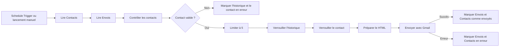
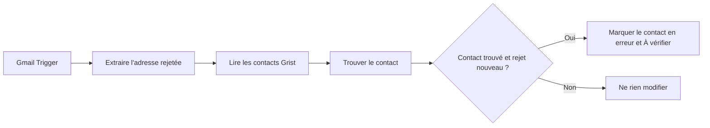
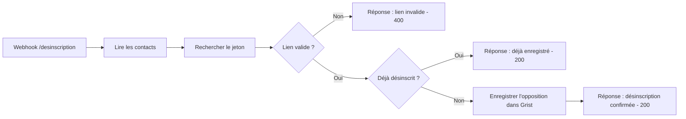

# Documentation technique des workflows n8n

Cette documentation décrit les trois automatisations n8n utilisées avec le widget Grist **Emailing Prospection** :

1. envoyer les emails préparés dans Grist ;
2. détecter les emails non distribués par Gmail ;
3. enregistrer les demandes de désinscription.

Elle correspond à l'export `Test Hanta (5).json` du 14 août 2026.

## 1. Comprendre le fonctionnement général

Le widget ne transmet pas directement un email à Gmail. Il prépare les données dans Grist :

- la fiche du contact est mise à jour dans `Contacts` ;
- une ligne d'historique est créée dans `Envois` ;
- n8n vient ensuite lire ces tables et effectue l'action demandée.

Cette séparation évite qu'un clic dans le widget envoie immédiatement un message sans contrôle.

### Petit vocabulaire n8n

| Terme | Explication simple |
|---|---|
| Workflow | Une automatisation composée de plusieurs étapes. |
| Nœud ou node | Une étape du workflow. |
| Trigger | Le nœud qui démarre l'automatisation. |
| Item | Une ligne de données qui circule entre les nœuds. Un contact correspond généralement à un item. |
| Expression | Une valeur dynamique entre `{{ }}`, récupérée depuis les données précédentes. |
| Branche `true` | Chemin suivi quand une condition est vraie. |
| Branche `false` | Chemin suivi quand une condition est fausse. |
| Success | Sortie utilisée lorsqu'un nœud a réussi. |
| Error | Sortie utilisée lorsqu'un nœud a échoué. |
| Credential | Connexion sécurisée à Gmail ou Grist. Le mot de passe n'est pas stocké dans le workflow exporté. |
| Publish | Rend actifs les triggers automatiques du workflow. |

## 2. Tables Grist utilisées

Le document Grist porte l'identifiant `18TPXjW19toMLTUfRrk7S8`.

### `Contacts`

Contient la fiche actuelle du prospect : identité, adresse email, statut, réponse, opposition et dernier résultat d'envoi.

### `Envois`

Conserve une ligne par tentative préparée :

- `Premier envoi` ;
- `Relance 1` ;
- `Relance 2`.

Cette table permet de conserver l'historique même lorsque la fiche du contact change.

### Règle importante

`Contacts` décrit l'état actuel du prospect. `Envois` décrit chaque opération passée ou en attente. Les deux tables sont donc mises à jour après un envoi.

---

# Workflow 1 - Envoyer les emails préparés

## 3. Objectif

Ce workflow récupère les envois préparés dans le widget, effectue tous les contrôles de sécurité, envoie au maximum cinq emails par passage, puis met à jour Grist.

Il traite de la même manière :

- un premier envoi ;
- une Relance 1 ;
- une Relance 2 ;
- un envoi immédiat ;
- un envoi programmé dont l'heure est arrivée.

## 4. Schéma simplifié



## 5. Déclencheurs

### `Schedule Trigger`

Démarre automatiquement le workflow selon l'intervalle configuré. Dans le projet, l'objectif est un passage toutes les cinq minutes.

### `When clicking 'Execute workflow'`

Permet de lancer manuellement le même parcours pendant les tests.

Les deux triggers rejoignent le même nœud `Grist`.

## 6. Lecture des données

### `Grist`

- opération : lire plusieurs lignes ;
- table : `Contacts` ;
- option : toutes les lignes.

Ce nœud récupère les contacts et leur état actuel.

### `Grist_Lire_Envois_En_Attente`

- table : `Envois` ;
- option : toutes les lignes.

Le nœud transmet les historiques au nœud de contrôle. Le code récupère parallèlement les contacts depuis le premier nœud `Grist`.

## 7. Contrôle des contacts

### `Code in JavaScript_Garder contacts à contacter`

Ce nœud constitue le filtre principal. Pour chaque contact, il :

1. détermine le type d'envoi attendu depuis le statut du contact ;
2. ignore les contacts déjà envoyés, en cours, en erreur ou archivés ;
3. attend l'heure demandée pour les envois programmés ;
4. retrouve la ligne correspondante dans `Envois` ;
5. vérifie les conditions obligatoires.

Un contact est accepté uniquement si :

- son statut est `À contacter`, `Relance 1` ou `Relance 2` ;
- son adresse possède un format valide ;
- il n'est pas archivé ;
- il n'a pas exprimé d'opposition ;
- aucun motif « ne pas contacter » n'est renseigné ;
- sa civilité ne nécessite pas de vérification ;
- le sujet et le corps sont présents ;
- le lien de désinscription est présent ;
- une ligne `Envois` correspondante existe avec le statut `En attente` ;
- le mode est `Immédiat` ou `Programmé` ;
- pour un envoi programmé, la date est valide et arrivée.

Le résultat contient notamment :

- `Controle_envoi` : `OK` ou `BLOQUE` ;
- `Raison_blocage` : explication lisible ;
- `Grist_row_id` : identifiant du contact ;
- `Envoi_row_id` : identifiant de l'historique ;
- `Type_envoi_final` ;
- `Email_final`, `Sujet_final` et `Corps_final`.

### `If_Contact_Valide`

Condition : `Controle_envoi` est égal à `OK`.

- sortie `true` : l'envoi continue ;
- sortie `false` : l'historique et le contact sont marqués en erreur.

### Branche bloquée

`Grist_Marquer_Historique_Bloque` met la ligne `Envois` en `Erreur`, puis `Grist_Marquer_Bloque` fait la même chose dans `Contacts` avec la raison du blocage.

## 8. Limite et verrouillage

### `Limit1`

Autorise au maximum cinq contacts par exécution.

Les autres restent `En attente` et seront récupérés au passage suivant. Cette limite réduit le risque d'envoi massif accidentel et facilite les tests.

### `Grist_Verrouiller_Historique`

Passe la ligne `Envois` de `En attente` à `En cours`.

### `Grist_Verrouiller_Envoi`

Passe également le contact à `En cours`.

Le verrouillage empêche qu'un passage suivant reprenne le même contact pendant son traitement.

### `Code_Restaurer_Contact`

Les nœuds Grist de mise à jour renvoient seulement les champs modifiés. Ce nœud remet donc dans le flux toutes les données originales conservées avant le verrouillage.

## 9. Création de l'email HTML

### `Code_Preparer_Email_HTML`

Ce nœud :

- protège les caractères HTML saisis dans le modèle ;
- transforme la syntaxe `[texte](https://adresse.fr)` en lien cliquable ;
- refuse les liens qui ne commencent pas par `http://` ou `https://` ;
- ajoute `Se désinscrire` si le modèle ne contient pas déjà le lien ;
- génère le champ `Corps_html`.

Marie n'a pas besoin d'écrire du HTML dans Grist.

## 10. Envoi Gmail

### `Send a message2`

- destinataire : `{{ $json.Email_final }}` ;
- sujet : `{{ $json.Sujet_final }}` ;
- message : `{{ $json.Corps_html }}` ;
- ajout de la mention n8n : désactivé ;
- comportement en cas d'erreur : utiliser la sortie `Error`.

Dans l'interface n8n, vérifier que **Email Type** est réglé sur **HTML**.

## 11. Après l'envoi

### Chemin `Success`

1. `Grist_Marquer_Historique_Envoye` met `Envois` à `Envoyé`, renseigne la date et l'identifiant Gmail.
2. `Grist_Marquer_Envoye` met à jour le contact.

Après un premier envoi, le statut du contact devient `Contacté`. Après une relance, il reste `Relance 1` ou `Relance 2`.

### Chemin `Error`

1. `Grist_Marquer_Historique_Erreur` enregistre l'erreur dans `Envois`.
2. `Grist_Marquer_Erreur` enregistre la même erreur dans `Contacts`.

Une erreur immédiate Gmail n'est pas la même chose qu'un rejet différé. L'erreur immédiate arrive pendant l'appel Gmail. Le rejet différé peut arriver plusieurs secondes ou minutes après que Gmail a accepté le message.

## 12. Test manuel conseillé

1. Préparer un seul contact Yopmail dans le widget.
2. Vérifier une ligne `Envois` en `En attente`.
3. Cliquer sur le trigger manuel puis exécuter le workflow complet.
4. Vérifier le passage `En attente` vers `En cours`, puis `Envoyé`.
5. Vérifier la date et `Identifiant Gmail` dans `Envois`.
6. Vérifier la réception de l'email et le lien de désinscription.

---

# Workflow 2 - Détecter les rejets Gmail

## 13. Objectif

Ce workflow repère les messages automatiques indiquant qu'une adresse n'existe pas ou ne peut pas recevoir d'emails. Il retrouve ensuite le contact concerné dans Grist et interdit sa relance.

## 14. Schéma simplifié



## 15. Détection Gmail

### `Gmail Trigger_ Détecter_Rejets_Gmail`

Le trigger interroge Gmail toutes les minutes avec la recherche :

```text
in:inbox {from:mailer-daemon@googlemail.com from:postmaster@google.com}
```

Il cible les messages automatiques de non-distribution présents dans la boîte de réception.

## 16. Extraction du rejet

### `Code_Extraire_Rejet`

Le code lit l'extrait Gmail (`snippet`) et recherche une adresse email. Il produit :

- `Email_rejete` ;
- `Motif_rejet` ;
- `Detail_rejet` ;
- `Gmail_message_id` ;
- `Gmail_thread_id` ;
- `Date_rejet` ;
- `Rejet_identifie`.

Si le texte contient `Adresse introuvable` ou un code `550 5.1`, le motif devient « Adresse inexistante ou ne pouvant pas recevoir de messages ».

## 17. Recherche du contact

### `Grist_Lire_Contacts_Rejets`

Lit les contacts de Grist.

### `Code_Trouver_Contact_Rejete`

Compare l'adresse rejetée avec :

- `Email_a_utiliser` ;
- `Email_corrige` ;
- `Email_trouvee` ;
- `Email`.

Le code compare les valeurs en minuscules et sans espaces inutiles.

Il compare aussi l'identifiant Gmail au champ `Dernier_rejet_Gmail_id`. Cela évite de traiter deux fois le même message de rejet.

### `If_Contact_Rejete_Trouve`

La branche `true` est utilisée seulement si :

- un contact correspondant a été trouvé ;
- le rejet n'avait pas déjà été enregistré.

La branche `false` ne fait rien.

## 18. Mise à jour Grist

### `Grist_Marquer_Non_Distribue`

Met à jour le contact avec :

- `Statut_envoi` : `Erreur` ;
- `Erreur_envoi` : motif du rejet ;
- `Statut` : `À vérifier` ;
- `Dernier_rejet_Gmail_id` : identifiant du message Gmail ;
- `Date_rejet` : date du rejet.

Ce contact n'est ensuite plus proposé dans les relances.

## 19. Test manuel conseillé

1. Utiliser une adresse inexistante mais syntaxiquement valide.
2. Envoyer un email avec le workflow 1.
3. Attendre le message de non-distribution dans Gmail.
4. Attendre au maximum le prochain passage du trigger Gmail.
5. Vérifier dans Grist : `Erreur`, `À vérifier`, motif et date du rejet.
6. Vérifier que le contact n'apparaît plus dans `Relances à préparer`.

---

# Workflow 3 - Enregistrer une désinscription

## 20. Objectif

Chaque contact possède un jeton unique dans Grist. Le lien ajouté à son email appelle le webhook n8n avec ce jeton :

```text
https://n8n.example.fr/webhook/desinscription?token=JETON_UNIQUE
```

n8n retrouve le contact, enregistre son opposition et affiche une page de confirmation.

## 21. Schéma simplifié



## 22. Réception du lien

### `Webhook_Desinscription`

- méthode : `GET` ;
- chemin : `desinscription` ;
- réponse : envoyée par un nœud `Respond to Webhook`.

L'URL de test contient `/webhook-test/`. Elle ne fonctionne qu'après avoir cliqué sur **Listen for test event**.

L'URL de production contient `/webhook/`. Elle fonctionne uniquement lorsque le workflow est publié.

## 23. Recherche du jeton

### `Grist_Lire_Contacts_Desinscription`

Lit les contacts dans Grist.

### `Code_Trouver_Contact_Desinscription`

Le code :

1. récupère `query.token` dans les données du webhook ;
2. compare ce token à `Jeton_desinscription` ;
3. renvoie l'identifiant Grist du contact ;
4. indique si le contact est déjà en opposition.

### `IfLien_Desinscription_Valide`

- `true` : un contact correspond au jeton ;
- `false` : `Respond_Lien_Invalide` renvoie une page avec le code HTTP `400`.

### `If_Deja_Desinscrit`

- `true` : la personne était déjà désinscrite ;
- `false` : il faut enregistrer son opposition.

Ce contrôle rend le lien réutilisable sans créer d'erreur lorsqu'une personne clique plusieurs fois.

## 24. Enregistrement dans Grist

### `Grist_Enregistrer_Desinscription`

Met à jour :

- `Opposition` : `true` ;
- `Statut` : `Opposition/refus` ;
- `Date_opposition` : date et heure actuelles ;
- `Origine_opposition` : lien de désinscription.

### Réponses affichées

| Nœud | Situation | Code HTTP |
|---|---|---:|
| `Respond_Desinscription_Confirmee` | Nouvelle désinscription enregistrée | 200 |
| `Respond_Deja_Desinscrit` | Opposition déjà présente | 200 |
| `Respond_Lien_Invalide` | Jeton absent ou inconnu | 400 |

## 25. Tests manuels conseillés

### Lien valide

1. Cliquer sur un lien reçu dans un email de test.
2. Vérifier la page « Désinscription confirmée ».
3. Vérifier dans Grist l'opposition, le statut, la date et l'origine.

### Deuxième clic

1. Cliquer une deuxième fois sur le même lien.
2. Vérifier la page « Désinscription déjà enregistrée ».
3. Vérifier qu'aucune erreur n'est produite.

### Lien invalide

1. Remplacer le token dans l'URL par une valeur fictive.
2. Vérifier la page « Lien invalide ou expiré ».
3. Vérifier qu'aucun contact n'est modifié.

---

# Exploitation et maintenance

## 26. Publier le board

Les trois workflows se trouvent sur le même board. Lorsque ce board est publié, les triggers actifs peuvent fonctionner :

- `Schedule Trigger` pour les envois ;
- `Gmail Trigger_ Détecter_Rejets_Gmail` pour les rejets ;
- `Webhook_Desinscription` pour les désinscriptions.

Avant de publier :

1. vérifier les credentials Grist ;
2. vérifier le credential Gmail ;
3. vérifier que Gmail envoie au format HTML ;
4. vérifier la limite de cinq ;
5. vérifier le chemin `desinscription` ;
6. faire un test avec une adresse fictive.

L'export JSON indique `active: false`. Cela signifie que cette copie exportée n'est pas marquée active. Vérifier l'état réel du bouton **Publish** dans n8n après un import.

## 27. Lire une exécution

Dans l'onglet **Executions** :

- vert : le nœud a réussi ;
- rouge : le nœud a rencontré une erreur ;
- gris : le nœud n'a pas été exécuté ;
- `Node was not executed` : le parcours n'est pas passé par cette branche ; ce message n'indique pas forcément une panne.

Toujours ouvrir le dernier nœud vert puis regarder son onglet **Output** pour comprendre les données transmises.

## 28. Incidents fréquents

### Aucun email ne part

Vérifier :

- le workflow est publié ;
- une ligne `Envois` est en `En attente` ;
- le contact n'est pas déjà `Envoyé`, `En cours` ou `Erreur` ;
- le statut correspond au type d'envoi ;
- l'heure programmée est arrivée ;
- le sujet, le corps et le lien de désinscription existent.

### Le contact reste `En cours`

Ouvrir l'exécution et vérifier si elle s'est arrêtée après un nœud de verrouillage. Corriger la cause, puis remettre manuellement le contact et sa ligne `Envois` dans un état cohérent avant de relancer.

### Gmail refuse l'accès

Reconnecter le credential OAuth Gmail. L'erreur `insufficient authentication scopes` signifie généralement que le credential n'a pas les autorisations nécessaires.

### Le webhook renvoie 404

- en test : cliquer sur **Listen for test event**, puis utiliser l'URL `/webhook-test/` ;
- en production : publier le workflow et utiliser l'URL `/webhook/`.

## 29. Corrections recommandées avant une forte augmentation du volume

### Retirer la limite de 100 contacts sur les workflows 2 et 3

`Grist_Lire_Contacts_Rejets` et `Grist_Lire_Contacts_Desinscription` utilisent actuellement une limite de 100 lignes. Au-delà de 100 contacts, un contact peut ne pas être retrouvé.

Dans chaque nœud Grist :

1. activer **Return All** si cette option est disponible ;
2. sinon augmenter la limite avec prudence ;
3. retester un contact situé après la centième ligne.

### Gérer le cas « Historique Envois manquant »

Dans le workflow 1, un contact sans ligne `Envois` reçoit la raison `Historique Envois manquant`. Le nœud suivant tente néanmoins de mettre à jour cette ligne avec un identifiant vide.

La solution recommandée est de créer une branche distincte :

- si `Envoi_row_id` est présent, mettre à jour `Envois` puis `Contacts` ;
- si `Envoi_row_id` est vide, mettre à jour seulement `Contacts` avec l'erreur « Historique Envois manquant ».

### Corriger une faute de libellé

Dans `Grist_Enregistrer_Desinscription`, remplacer :

```text
Lien de désinscritpion
```

par :

```text
Lien de désinscription
```

Cette faute n'empêche pas le fonctionnement, mais elle apparaît dans Grist.

## 30. Sauvegarde

Après chaque modification importante :

1. renommer clairement la version publiée ;
2. décrire les changements ;
3. télécharger un nouvel export JSON ;
4. ne jamais publier les credentials ou secrets dans GitHub ;
5. conserver une copie du workflow précédemment fonctionnel avant une modification complexe.

